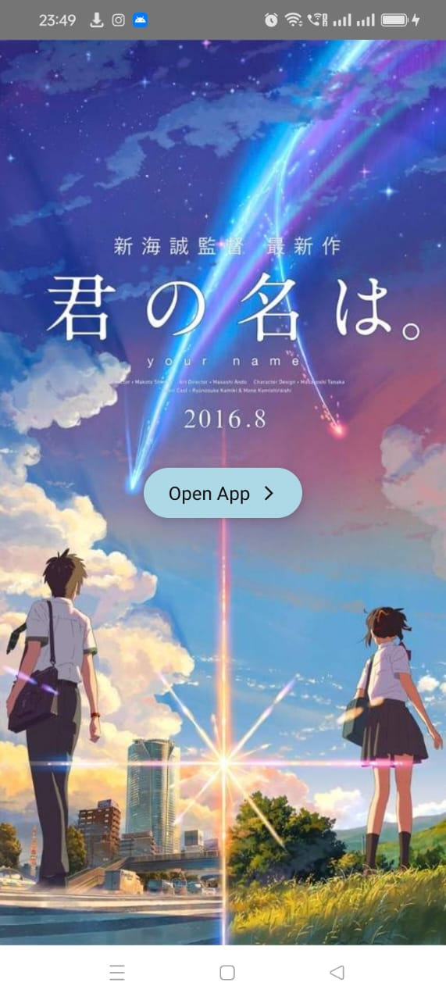
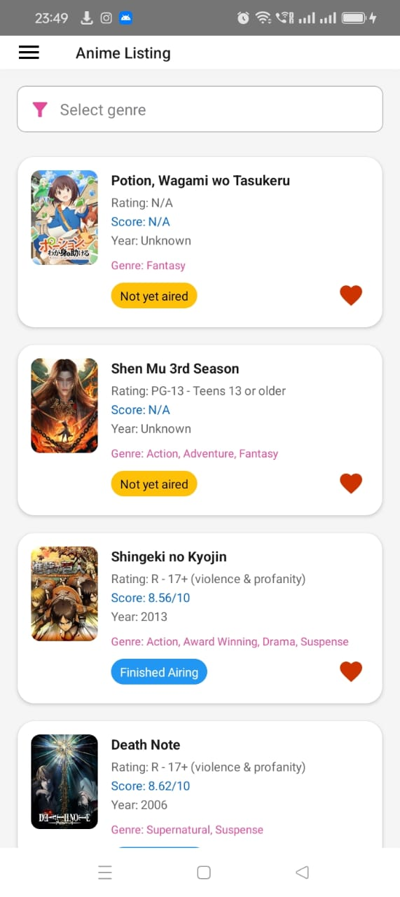
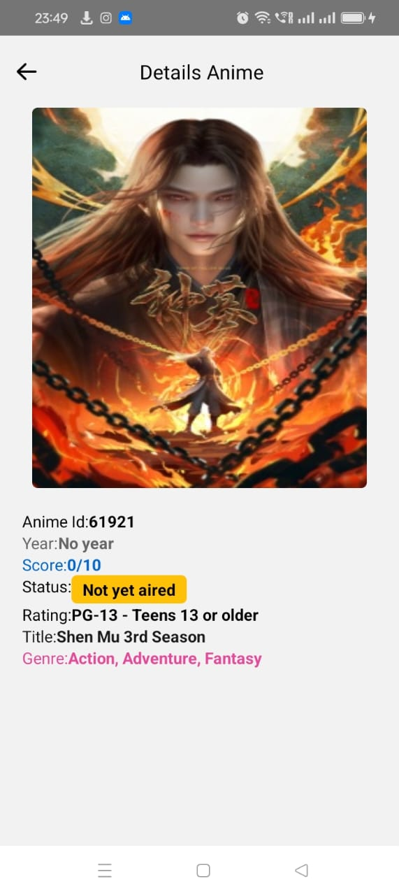
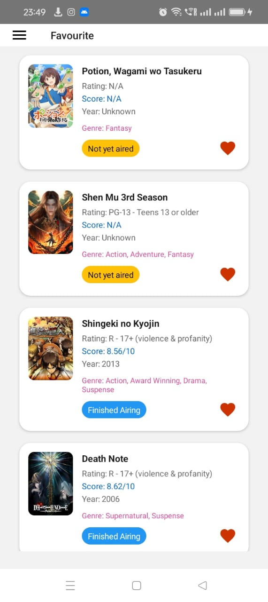

# Anime Movie App (React Native)


A mobile application for browsing anime movies and series built with React Native and TypeScript.

## Features

- Browse popular anime
- View anime details
- Filter by genres
- Mark favorites
- Infinite scroll loading
- Responsive design

## Screens

1. **Welcome Screen** (`IndexWelcomeAnimeContainer`)
2. **Listing Screen** (`IndexListingAnimeContainer`)
3. **Detail Screen** (`IndexDetailAnimeContainer`) 
4. **Favorites Screen** (`IndexFavouriteAnimeContainer`)

## Prerequisites

- Node.js v18.20.4
- npm or yarn
- React Native development environment setup
- Android Studio/Xcode for emulators

## Installation

1. **Clone the repository**:
   ```bash
   git clone https://github.com/kels-git/Anime-Movie-React-Native.git
   cd anime-movie-react-native

## Install dependencies:

```bash
# using npm
npm install

# OR using Yarn
yarn install
```

## If you encounter peer dependency issues:
```bash
npm install --legacy-peer-deps
```

## Key Libraries Used

- React Native v0.72+
- React Navigation v6.x
- Redux Toolkit for state management
- react-native-vector-icons for icons
- react-native-fast-image for optimized image loading
- tailwind-rn for styling
- axios for API calls
- react-native-element-dropdown for UI components

## App Screenshots

<div style="display: flex; flex-wrap: wrap; gap: 10px;">
  
  
  
   
</div>